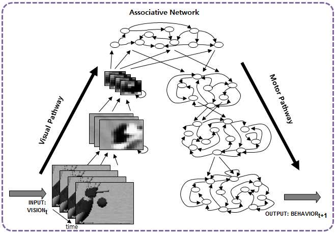

# icub-tensorflow
Visuo-motor learning of simulated iCub robot [[1]](http://dl.acm.org/citation.cfm?id=1774684) using a deep learning model implemented in Tensorflow (tested on simple toy task). [Github page](https://github.com/kkjh0723/icub-tensorflow)

Trained checkpoint file is too large to upload. You need to train using the `train_rnn.py` or we might upload the file in other places later. 

# Requirements
* C++
* Yarp and iCub (iCub_SIM)
  * [iCub software installation from source](http://wiki.icub.org/wiki/Linux:Installation_from_sources)
  * NOTE: in order to manipulate cylinder objects in the simulator, cylinder-cylinder collision is required because the robot's finger is also a cylinder. You need to install ODE with `--enable-libccd` option. [intalling ODE](http://wiki.icub.org/wiki/Linux:_Installing_ODE) 
  * Screen inside the simulator needs to be ON (It is set to show just checker board image in this sample experiment, but we are going to use it for gesture recognition task later). In order to turn on the screen, you need to change `screen` to `on` in `iCub_parts_activation.ini` inside `{iCub-folder}/contexts/simConfig` directory.
  * In order to make the manipulation easier, we change the friction between objects and hands. We set the friction coefficient very large (1000000.0). You can change `contactFrictionCoefficient` in `ode_params.ini` inside `{iCub-folder}/contexts/simConfig` directory.
  * You can find more information about iCub simulatior in [simulator README](http://wiki.icub.org/wiki/Simulator_README)
* Yarp python biding 
  * [Yarp python binding](http://wiki.icub.org/wiki/Python_bindings)
  * iCub-python binding might not be required to run this codes 
* Python 2.7
* Tensorflow
  * [Tensorflow installation](https://www.tensorflow.org/install/)
* tcmalloc (about memory performance using Tensorflow, refer to [Github issues #3009](https://github.com/tensorflow/tensorflow/issues/3009) and [Stackoverflow](http://stackoverflow.com/documentation/tensorflow/3883/how-to-debug-a-memory-leak-in-tensorflow#t=201704110952423938271))

# Tested environment
* Ubuntu 14.04
* Yarp 2.3.66
* iCub 1.4.0
* Python 2.7 (Anaconda)
* Tensorflow 0.12.x

# Task & Model
* We tested the program in a very simple object manipulation task. There is only one object (which can be different location, shapes and sizes) in front of the robot and the robot is trained to grasp the object. The experiment settings are similar to previous works [[2]](http://neurorobot.kaist.ac.kr/pdf_files/ICDL_2016_JS.pdf) and [[3]](https://arxiv.org/abs/1507.02347)
* [NOTE] Since the purpose of this code is to test connecting iCub simulator and tensorflow, we ignore some necessary components for training and examining deep neural networks. First, we don't use any validation data although checking validation loss was implemented in the training code (we use same training data to validation). Second, we don't test generalization but only check whether the network do operate as it trained. The testing situation on the simulator is exactly same as the training data. We may conduct real research experiments based on this code in the future.
* Training Dataset
  * Visual input: 48x64 size, greyscale value range from [-1,1]
  * Joint output: 10 DoF joints from iCub left arm and neck are used and each joint is sparsely transformed into 10 dimension. In conclusion, model's output dimension is 10x10 
  * Training datasets are collected using a dedicated program which is not shared in this repository. The structure of the dataset program is basically same as the online testing program in this repository but the motor generation part is replaced by hand coded program and saving vision(from iCub camera) and motor(from iCub joint) sequences parts are added. You can  either make the data collecting program or change the online testing program depending on your task senario.
* We trained a CNN-RNN structure especially CNN-LSTM model for testing (the model can be changed to VMDNN [[2]](http://neurorobot.kaist.ac.kr/pdf_files/ICDL_2016_JS.pdf) using `BasicConvCTNNCell` in `BasicConvLSTMCell.py` and `BasicCTRNNCell` in `rnn_cell_ext.py`)
        
*Figure. VMDNN model without attention control. The model in the program is implemented based on the model in the figure. The figure is adopted from the final report of "Study on Application of Curriculum Learning in Deep Developmental Robotics" project funded by Venture Research Program for Graduate and PhD Students 2016 (VRPGP 2016)*

# Organization of the code
* For training a model
  * `train_rnn.py`: main program for training a deep neural network model using Tensorflow. Import model from `model.py` 
  * `model.py` : defining Tensorflow graph of the network model. you can define a new model you want to test.
  * `BasicConvLSTMCell.py` : implementation of convolutional LSTM(or RNN) [[4]](https://arxiv.org/abs/1506.04214) by [loliverhennigh](https://github.com/loliverhennigh/Convolutional-LSTM-in-Tensorflow). We added `BasicConvCTRNNCell` where LSTM cells are replaced by continuous time RNN (CTRNN) cells and `BasicConvCTNNCell` where LSTM cells are replaced by leaky integrator cells (as in MSTNN model [[5]](http://journals.plos.org/plosone/article?id=10.1371/journal.pone.0131214))
  * `rnn_cell_ext.py`: implementation of normal CTRNN
  * `data` directory: contains dataset
    * `dataset_np` directory: `npz` format file which contains dataset in list of `numpy` arrays
    * `gestureVideos` directory: contains images to project in screen inside simulator
    * `label`directory: sparsely transformed motor target
    * `TRIAL_LIST`directory: list of visuo-motor sequence for training (in the sample experiment, only 4 digits number in the first colunm has meaning. The number of rows are same as the number of training sequences)
      * 1st digit: object type (1: Ball, 2: Box, 3: Cylinder)
      * 2nd digit: object size (1: Big, 2: Small)
      * 3rd digit: object location (0-9 : different positions in front of the robot)
      * 4th digit: object orientation (set 0 for all data)
    * `vision` directory: visual input
      
* For online testing in the simulator 
  * `controller`: main program which controls iCub robot and synchronizes other sub-programs for the online testing. 
  [YARP](http://www.yarp.it/) is used to communicate between each sub-programs.
  * `worldManipulator`: a program which set the task environment according to the direction from `controller` (making and removing objects and tables)
  * `fingerGrasper`: a program which controls the grasping level (a single scalar value from 0 to 10) as used in previous works [[2]](http://neurorobot.kaist.ac.kr/pdf_files/ICDL_2016_JS.pdf) and [[3]](https://arxiv.org/abs/1507.02347) 
  * `vision`: a program which captures visual scene from iCub camera for the network input and sends it to the `main.py` according to the direction from `controller`
  * `screenWriter`: a program which projects images to the screen inside the simulator
  * `main.py`: a Tensorflow program which loads trained the checkpoint file, calculate model outputs and send it to the `controller` at each time step
  * `homePositions` directory: contains iCub's initial positions
  * `softmaxConfig` directory: contains information for motor transform and inverse transform 
  * `trialConf` directory: list of test trials
  
# Training
1) Run `bash run_programs.sh` (or `python train_rnn.py` with proper options)
  * Some options
    * `data_dir` and `data_fn`: for specifying dataset location and file name
    * `log_dir`: a directory for saving Tensorflow checkpoint file
    * `device`: select CPU or GPU for training
    * Some hyper-parameters for the model (e.g. `lr`, `batch_size`,  and etc)
    

# Testing in the iCub simultor (iCub_SIM)
1) Launch the simulator
  * in one terminal: `yarpserver`
  * in another terminal: `iCub_SIM`
2) Build online testing program
  * move to `onlineTestingProgram` folder and then move to`build` folder (make if there isn't)
  * `cmake ../`
  * `make`
3) Run online testing program
  * Run `python main.py` in `onlineTestingProgram` folder (you might need to provide proper options e.g. `--log_dir ./../log_dir01_01')
    * Some options
       * `log dir`: a directory which contains check point file of trained model
       * `max_leng`: maximum time steps you want to test
       * `use_data_vision`,`use_data_motor`, and `use_data_vision` : for checking offline trained performance and debugging 
       * `save_states` and `save_dir`: for saving internal states of the model while testing.
  * Run `./worldManipulator`, `./fingerGrashper`, `./vision`, `./screenWriter` and then `./controller` in seperate terminals (`./controller` should be the last one)
    * [NOTE] you can make a simple script to run all programs in one terminal (refer to `llauncher` and `killer` in `onlineTestingProgram` folder)  

# References
[1] Tikhanoff, Vadim, et al. "An open-source simulator for cognitive robotics research: the prototype of the iCub humanoid robot simulator." Proceedings of the 8th workshop on performance metrics for intelligent systems. ACM, 2008.

[2] J. Hwang, M. Jung and J. Tani: “A Deep Learning Approach for Seamless Integration of Cognitive Skills for Humanoid Robots”, ICDL International Conference Developmental Learning and Epigenetic Robotics (ICDL-EPIROB), 2016

[3] J. Hwang, M. Jung, M. Madapana, J. Kim, M. Choi, J. Tani: "Achieving “Synergy” in Cognitive Behavior of Humanoids via Deep Learning of Dynamic Visuo-Motor-Attentional Coordination", To appear in Proc. of 2015 IEEE-RAS International Conference on Humanoid Robots

[4] Xingjian, S. H. I., et al. "Convolutional LSTM network: A machine learning approach for precipitation nowcasting." Advances in Neural Information Processing Systems. 2015.

[5] Jung, Minju, Jungsik Hwang, and Jun Tani. "Self-organization of spatio-temporal hierarchy via learning of dynamic visual image patterns on action sequences." PloS one 10.7 (2015): e0131214.
